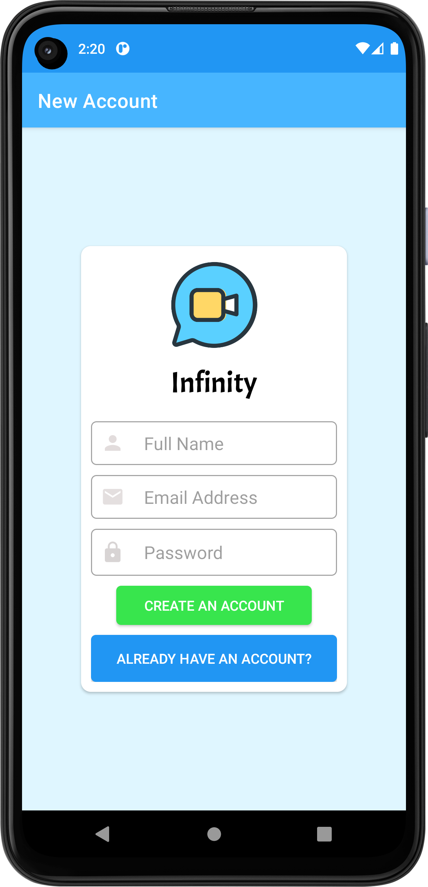
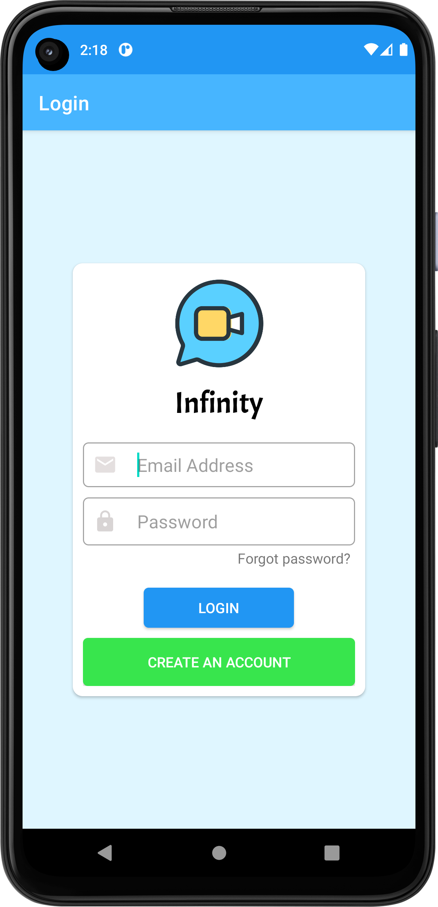
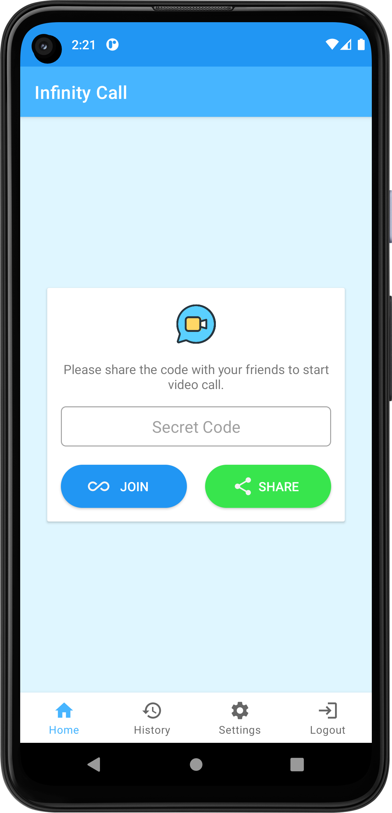
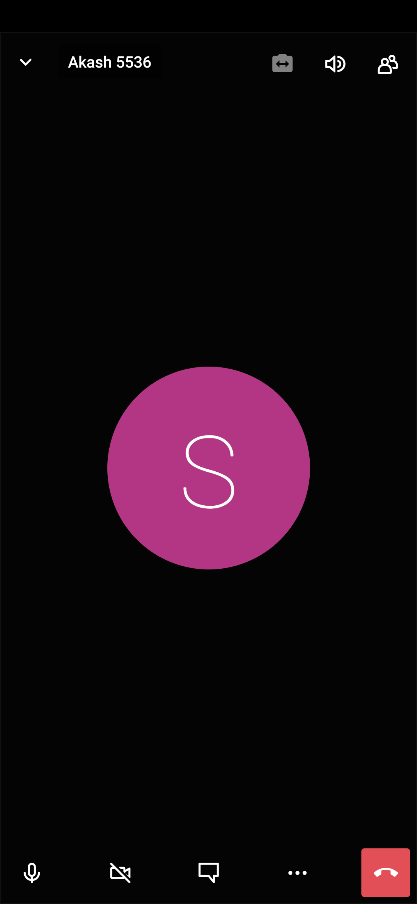

# Infinity-Call

<h1 align="center">Hi 👋, I'm M.k.Akash</h1>
<h3 align="center">A passionate Android developer from India</h3>

  

- 🔭 I’m currently working on **Infinity call app**

<h3 align="left">Infinity call app</h3>

- Infinity Call is a Video Conference Android app.
- It is a fully encrypted, 100% Secured Video conferencing app that you can use all day for free. Used Jitsi Meet SDK ,it enables built-in 
  features such as
- chat, screen sharing, and recording. 

<h3 align="left">Screen shots</h3>

<table>
    <tr>
        <td></td>
        <td></td>
    </tr>
    <tr>
        <td>Create Acount Screen</td>
        <td>Login Screen</td>
    </tr>
</table>
<table>
    <tr>
        <td></td>
        <td></td>
    </tr>
    <tr>
        <td>Home Screen</td>
        <td>Meeting Screen</td>
    </tr>
</table>

<h3 align="left">Languages and Tools:</h3>

      

&nbsp;

